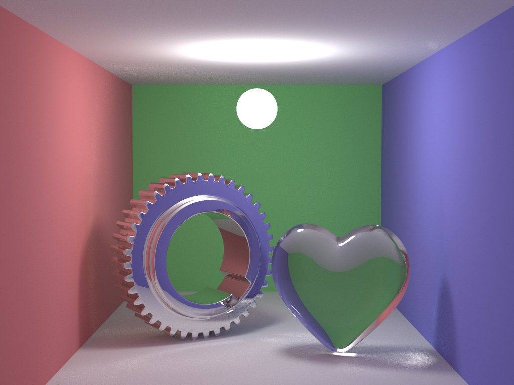
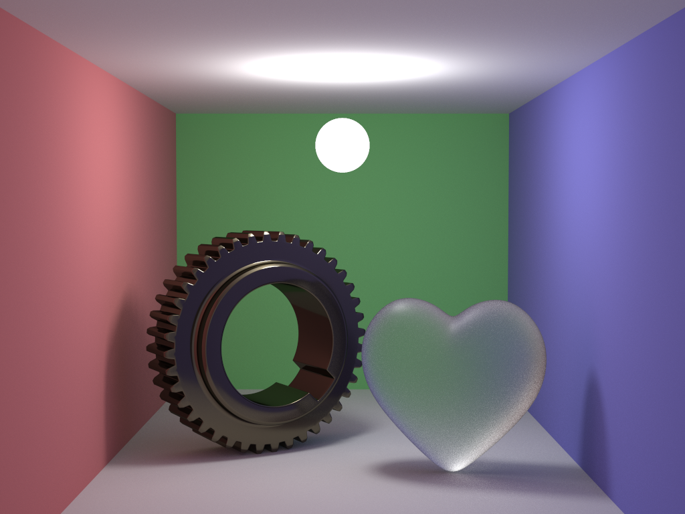

# Трассировка пути
Данный проект представляет собой реализацию глобального освещения
методом трассировки пути (path tracing) с PBR материалами.
Он позволяет отрендерить сцену Корнуэльской комнаты с двумя объектами, 
материалы и 3D-модели которых пользователь может выбирать интерактивно.
Проект написан на C++ с использованием возможностей OpenMP для параллельных вычислений. 
После завершения расчетов результат отображается в окне и может быть сохранен на диск.

Изображения в разрешении 1024x768, 4096 семплов на пиксель

## Особенности
* Параллельный рендеринг на CPU (OpenMP)
* Интегрирование Монте-Карло
* Russian Roulette для ограничения глубины
* Прямое семплирование источника света (Next Event Estimation)
* BRDF на основе микрограней для шероховатых материалов
* BVH для ускорения вычислений
* 2×2 стохастический суперсемплинг
* Поддержка 3D-моделей в формате .obj
* GUI-просмотр и экспорт изображения

## Поддерживаемые материалы
### Гладкие
* Диффузный (Lambert)
* Зеркальный
* Прозрачный (идеальный диэлектрик)

### Шероховатые (на основе микрограней)
* Шероховатый металл
* Шероховатый диэлектрик (к примеру, матовое стекло или пластик)

Параметр шероховатости задаётся в диапазоне [0, 1].

## Этапы рендеринга
1. Инициализация сцены
2. Построение BVH
3. Рекурсивная трассировка лучей
4. Накопление результатов семплинга
5. Ограничение значений цвета
6. Отображение через OpenGL
7. Сохранение изображения (опционально)

## Используемые технологии
* C++17
* OpenMP
* OpenGL
* GLFW
* Dear ImGui
* stb_image_write

-------------------------------------------------------------

# Path tracing
This project is an implementation of global illumination using the path tracing method with PBR materials. 
It allows rendering a Cornell Box scene with two objects, where the user can choose materials and 3D models for each. 
The project is written in C++ and leverages OpenMP for parallel computing. 
After calculations are complete, the result is displayed in a window and can be saved to disk.

## Features
* Parallel CPU rendering (OpenMP)
* Monte Carlo integration
* Russian Roulette for path termination
* Next Event Estimation (NEE) for direct light sampling
* Microfacet-based BRDF for rough materials
* BVH acceleration structure for ray intersections
* 2×2 stochastic supersampling
* .obj 3D model support
* GUI viewer and image export

## Supported Materials
### Smooth
* Diffuse (Lambertian)
* Specular (mirror)
* Transparent (ideal dielectric)

### Rough (microfacet-based)
* Rough metal
* Rough dielectric (e.g., frosted glass or plastic)

Roughness parameter can be set in the [0, 1] range.

## Rendering Pipeline
1. Scene initialization
2. BVH construction
3. Recursive ray tracing
4. Sampling accumulation
5. Color clamping
6. Display with OpenGL
7. Image saving (optional)

## Technologies Used
* C++17
* OpenMP
* OpenGL
* GLFW
* Dear ImGui
* stb_image_write
